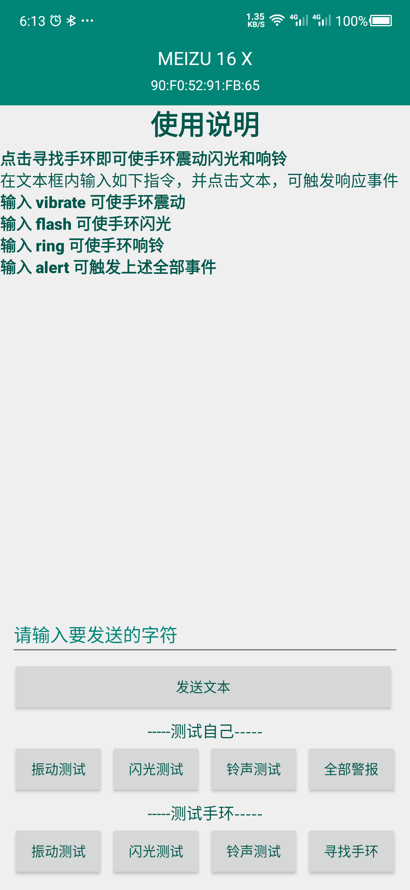

## 蓝牙手环防丢失 防遗失

### 功能
- 断连警报
- 寻找我的手机
- 震动、响铃、闪光提示
### 运行截图

 

定义
> bandapp 为client端
>
> band 为server端
>
> 在蓝牙的连接服务中，连接正常，则在band中打开下一个activity
>
主要有以下几个包：

- band为手环的service和activity
- base为主acitivity，callback显示各设备的蓝牙状态，bleadapter将设备信息加载到listview中
- client端为客户端 deviceactivity是设备的显示界面，uuidadapter显示设备的主要uuid，clientserivce发送和接受信息的service
- acceptservice可以接受client端的连接信息，并打开手环界面
- serverrservice为发送接受信息的service
- flashsosthread为闪关灯的线程
- flashutils用占空比和循环实现了sos效果
- ringthread 调用ringtone 响铃的线程
- vibratethread 调用vibrator 震动的线程

测试端在运行连接之后，给手环发送配对连接信息，经过acceptservice同意后，手环端打开bandactivity，同时测试端打开debugactivity

具体的如何配对连接绑定状态，还有uuid，可以去百度搜一搜新的博客，都是一样的原理。去android开发官网也可以。

其中线程和handler机制，需要熟悉。
